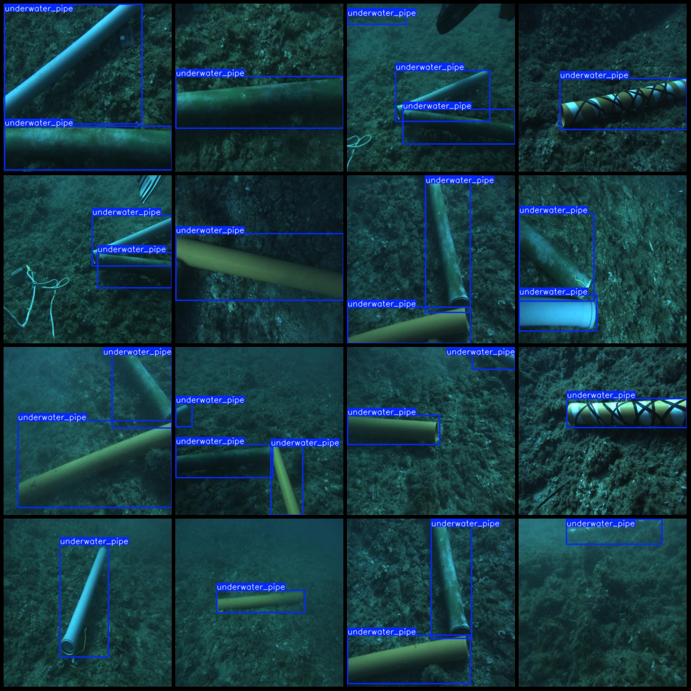
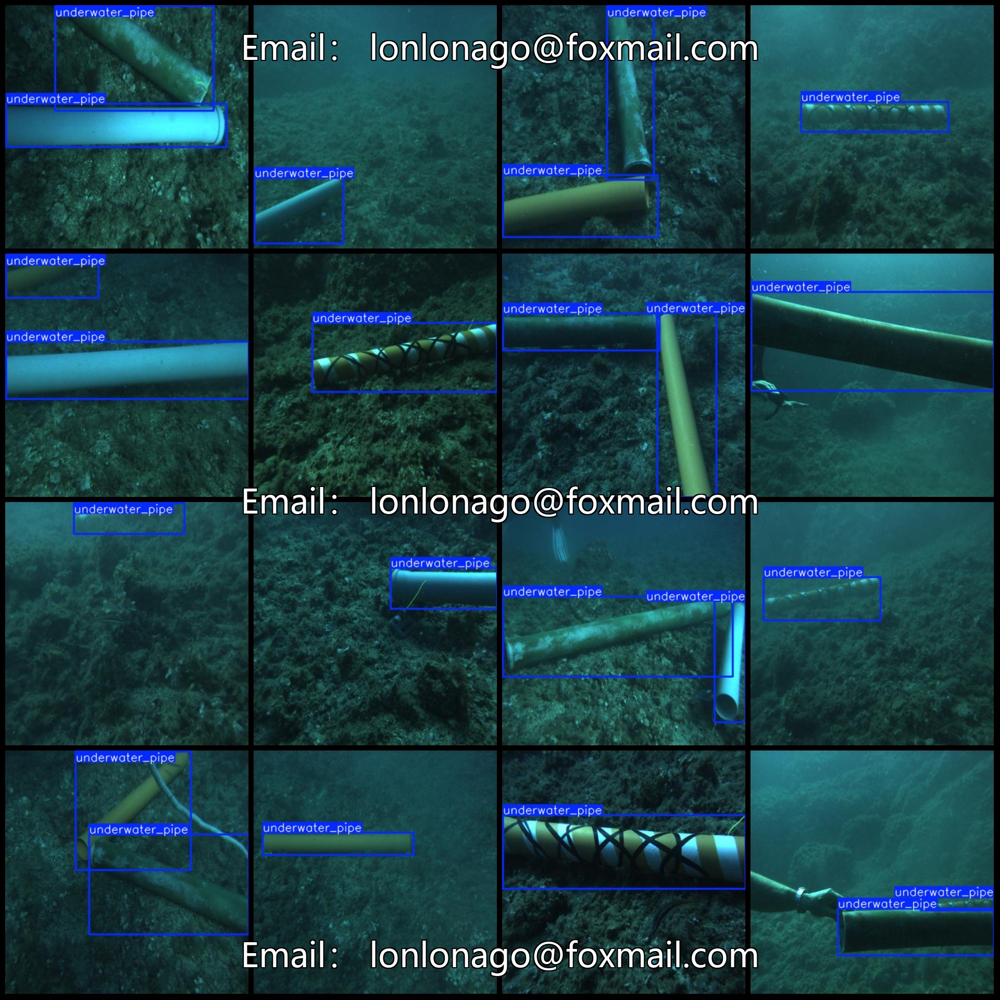

# Underwater Pipe Detection Data Set: VOC+YOLO Format (7,441 Images, 1 Category)

Dataset Format: Pascal VOC format + YOLO format (txt files without split paths, only containing jpg images and corresponding VOC format xml files and yolo format txt files).

Number of Images (jpg file count): 7,441
Number of Annotations (xml file count): 7,441
Number of Annotations (txt file count): 7,441
Number of Annotation Categories: 1
Annotation Category Name: "underwater_pipe"
Number of Boxes per Category:
underwater_pipe box count = 12,238
Total boxes: 12,238
Image Resolution: 416x416
Using Annotation Tool: labelImg
Annotation Rules: Draw bounding boxes for categories
Important Notice: The dataset does not have a training validation test split; you need to divide it yourself.
Special Declaration: This dataset does not guarantee the accuracy of the trained models or weight files.
Image Preview:
Annotation Example:

## Images

Here is a pay link on Stripe ( https://buy.stripe.com/3cs8yP7sY87d0vu9AB ). Please contact me lonlonago@foxmail.com after funding $89, and I will send you a complete data files , thank you!

